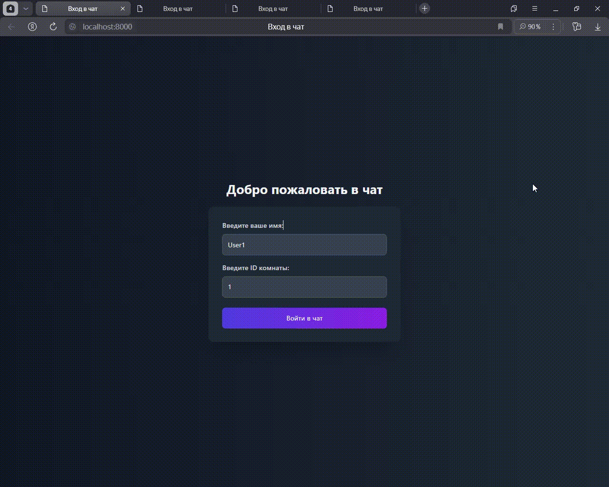

# 🚀 WebSocket Chat Application

A simple and stylish group chat application using WebSocket. Users can create rooms, join existing ones, and exchange messages in real-time.



---

## 🌟 Features

- **Real-time messaging**: Instant message delivery.
- **Rooms**: Create and join rooms by ID.
- **Dark theme**: Sleek design in dark tones.
- **Simplicity**: Minimalistic and intuitive interface.

---

## 🛠 Technologies

<div align="center">

### Backend


### Frontend


</div>

---

## 🚀 Quick Start

### 1. Install Dependencies

Make sure you have the required dependencies installed for the backend:

```bash
pip install -r requirements.txt
```

### 2. Run the Server

Start the WebSocket server:

```bash
uvicorn app.main:app
```

### 3. Launch the Client
Open Web-browser and go to the page 
**http://localhost:8000/**

## 🖥 Interface

### Home Page

- Enter your username and room ID.
- Click "Join Chat".


### Chat Page

- Send messages in real-time.
- Messages are displayed with different styles for yourself and others.


## 📂 Project Structure

```
|-- README.md
|-- app
|   |-- api
|   |   |-- router_page.py        # Routes for rendering pages
|   |   `-- router_socket.py      # WebSocket routes
|   |-- main.py                   # FastAPI application entry point
|   |-- manager
|   |   `-- connection_manager.py # WebSocket connection manager
|   |-- static
|   |   `-- index.js              # WebSocket logic and message handling
|   `-- templates
|       |-- home.html             # Home page for joining the chat
|       `-- index.html            # Chat page
|-- pyproject.toml                # Project metadata and dependencies
|-- requirements.txt              # Python dependencies
`-- uv.lock                       # Lock file for dependency versions
```
